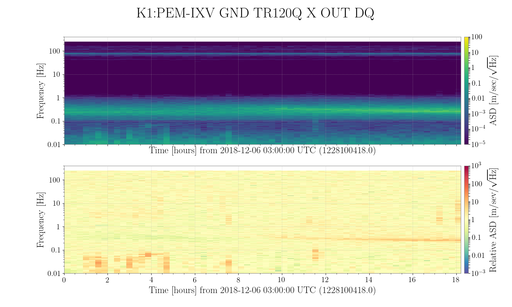
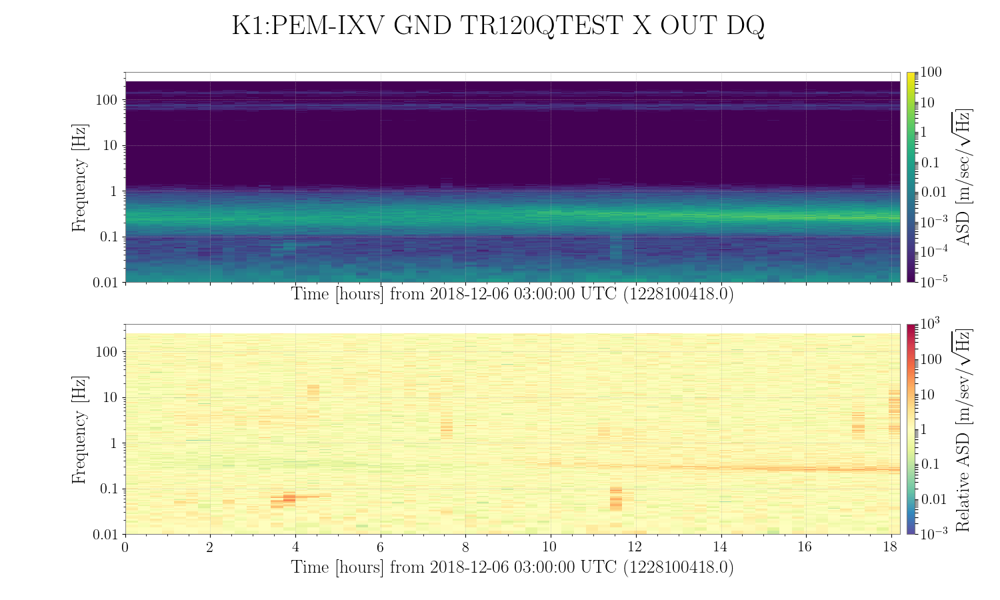
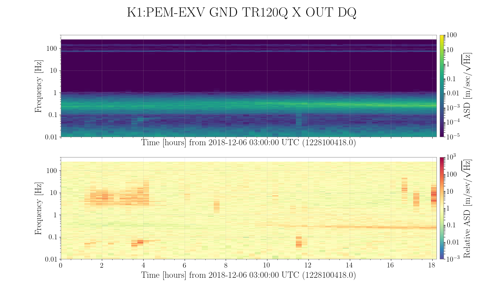

# Noise
## データ1
### 期間

* start : Dec 6 12:00:00 JST
* tlen : 2**16 (18hours)
* fftlen : 2**9 (512seconds)

### チャンネル
1. IXV
2. IXV_TEST
3. EXV

### setup
30dbのフラットなアンプをいれた。

**ブロック図を描く**

**ノイズバジェットを描く**

* Whiteningの雑音をJGWDocから引用
* ADCの雑音を引用
 

## 結果と考察
### Amplitude Spectrum Density
* 30dbのアンプを入れたので、

### Coherence

### Coherent Signal

### Non-coherent Signal

### Spectrogram

### 次やること
取ってきたデータが定常じゃないので、定常な時を探してプロットする。
