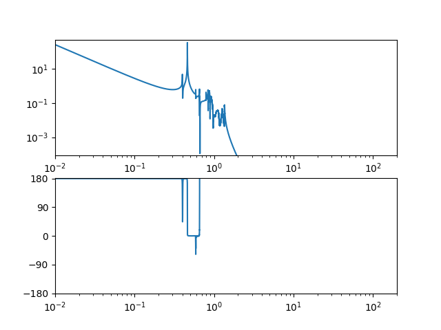

# TypeM

* とりあえず、どうモデルから伝達関数とかの情報を抜き出せばいいか勉強するためのディレクトリ。
* Matlab上で"demo"と"typeBp"のモデルが動くことは確認できたので、次はTypeAに。


## ファイル構成
* demo
 * 藤井君がつくった簡単なデモファイル置き場。
 * Matlabが動くのを確認した。
* typeBp
 * SuspensionControlModel/script/TypeBp_PR/bKAGRATypeBp/PR3/にある、typeBp_TF_cmp_170704.mからファイルをコピーしてきた。それに関係するファイルもすべてTypeM/typeBp以下に置いた。
 * 
* python-control
 * Python-controlでMatlabと同じことをしてみるディレクトリ
 * demo.pyで、単振り子について伝達関数が書けた。
 * main.pyで、TypeBpのlinmod.matからLinearizeされたStateSpaceを読みこんで、同じことをしてみた。


## 番外編；PythonでStateSpaceを読み出した結果
番外編として、ちょっと欲がでてPythonから呼び出せないか頑張っている。
PythonでStateSpaceを読み出すための手順は以下のとおり。

1. MatlabでlinmodしたあとのStateSpaceをMATファイルに保存
2. Scipyで読んで、StateSpaceのABCDと入力名、出力名を抜き出す。
3. それをPython-ControlでゴニョゴニョしてSISOの伝達関数を求める。

demoぐらいの小さなシステムだと上手く動くのは確認した。でもどうやら、TypeBpのは描画が上手くいっていないようだった。




ABCD行列を確認するのはすごく面倒。とりあえず、TypeBpで頑張るのもあれなので、TypeAにいく。

## Python-Controlをつかうには
### Slycotのインストール
 slycotがないとMIMOの伝達関数が作れないと言われた。以下でインストールする。 インストール方法は[ここ](https://github.com/python-control/Slycot)にある。

```
 brew install gcc
 brew install lapack
 brew install openblas
 pip install slycot
```

Lapackをインストールしたらこうなった。

```
$ brew install lapack
Updating Homebrew...
==> Auto-updated Homebrew!
Updated 1 tap (homebrew/core).
==> Updated Formulae
fx

==> Downloading https://homebrew.bintray.com/bottles/lapack-3.8.0_1.sierra.bottle.tar.gz
######################################################################## 100.0%
==> Pouring lapack-3.8.0_1.sierra.bottle.tar.gz
==> Caveats
lapack is keg-only, which means it was not symlinked into /usr/local,
because macOS already provides this software and installing another version in
parallel can cause all kinds of trouble.

For compilers to find lapack you may need to set:
  export LDFLAGS="-L/usr/local/opt/lapack/lib"
  export CPPFLAGS="-I/usr/local/opt/lapack/include"

For pkg-config to find lapack you may need to set:
  export PKG_CONFIG_PATH="/usr/local/opt/lapack/lib/pkgconfig"

==> Summary
🍺  /usr/local/Cellar/lapack/3.8.0_1: 28 files, 10MB

```

openblasをインストールした結果、


```
$ brew install openblas
==> Downloading https://homebrew.bintray.com/bottles/openblas-0.3.4.sierra.bottle.tar.gz
######################################################################## 100.0%
==> Pouring openblas-0.3.4.sierra.bottle.tar.gz
==> Caveats
openblas is keg-only, which means it was not symlinked into /usr/local,
because macOS provides BLAS and LAPACK in the Accelerate framework.

For compilers to find openblas you may need to set:
  export LDFLAGS="-L/usr/local/opt/openblas/lib"
  export CPPFLAGS="-I/usr/local/opt/openblas/include"

For pkg-config to find openblas you may need to set:
  export PKG_CONFIG_PATH="/usr/local/opt/openblas/lib/pkgconfig"

==> Summary
🍺  /usr/local/Cellar/openblas/0.3.4: 21 files, 117.9MB
```


#### SLICOTについて
ちなみにSlycotは、Subroutine Library in Systems and Control Theory (SLICOT)というライブラリのPythonラッパーらしい。Matlabにもラッパーは存在していて、[ここ](http://slicot.org/matlab-toolboxes)によれば、

```
SLICOT Basic Systems and Control Toolbox
SLICOT Model and Controller Reduction Toolbox
SLICOT System Identification Toolbox
```
の3つがあるとのこと。なるほど。
