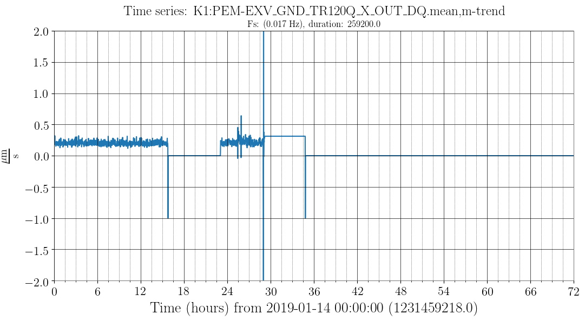

# monitor
 
## このディレクトリについて
 * モニターするためのスクリプト等をここにまとめて、すぐに使えるようにしておく。
 * 

## Usage
### Plotting TimeSeries
```
gwpy-plot timeseries --chan K1:PEM-EXV_GND_TR120Q_X_OUT_DQ.mean,m-trend --start "Jan 14 2019 00:00:00" --duration 259200  -n k1nds0 --pad -1 --
ymin -2 --ymax 2
```
 

### main_gif.py
