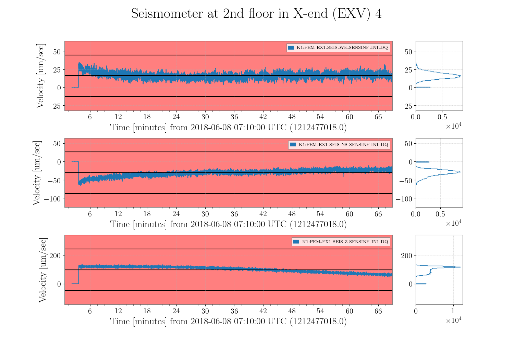
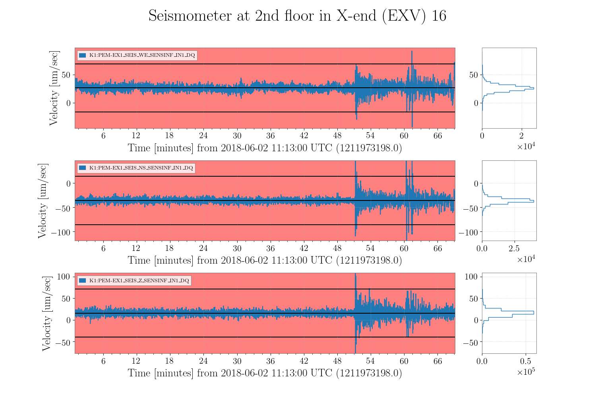
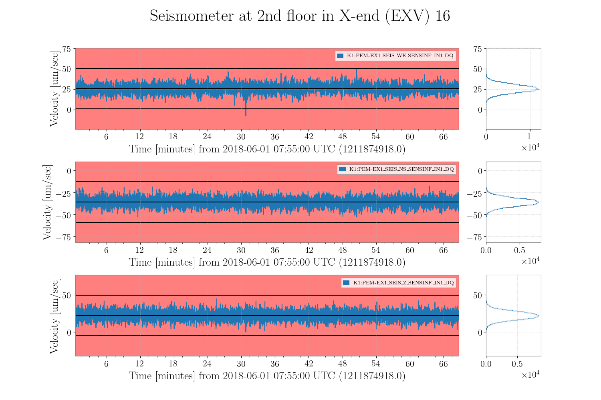
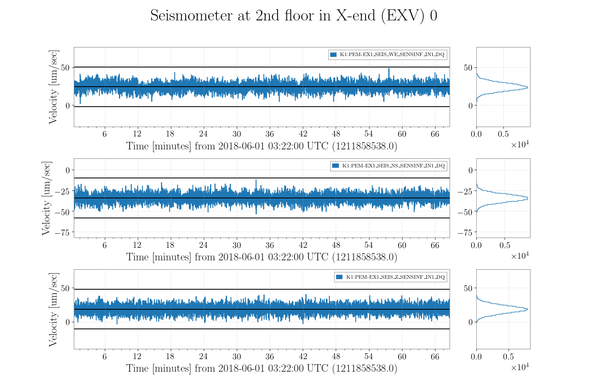

# Long Term Seismic Noise
## Overview
Long term seismic noise spectra of KAGRA is calculated. Although such long term spectra are also calculated in 2012 by T. Sekiguchi, it is the seismic noise spectra in the mine of CLIO not in KAGRA. In comparison with this past calculation, this new calculation gives an actual seismic noise spectra of KAGRA.

This long spectra are taken from almost 1 year period using a seismometer at 2nd floor in the X-end station, which is named EXV. In EXV area, there are less human activity than both the Y-end station and the corner station because of no gateway to outside in X-end.

This calculation also provide an information of seismometer signals. One can use the information which is described in "Data segment" sub-section to calculate other seismic related study in KAGRA.

## Data
### Period
Almost 1 year data are used. In order to reduce the amount of the FFT calculation duration of such long data is 2**25 seconds which is close to 1 year. Start GPS time of data is choosed from a head GPS time of the frame file. For example, 1211817600 is a head time of all type of framedata such as the full data, the minute trend and second trend.

| Start Time              | End Time                | Duration (End-Start)  |
|:-----------------------:|:-----------------------:|:---------------------:|
| 1211817600              | 1245372032              | 2**25 [sec]           |
| 2018-05-31T15:59:42 UCT | 2019-06-24T00:40:14 UTC |         ---           |

### Channel names
Channels of the seismometer at 2nd floor at the X-end station (named EXV) is used. In order to avoid confusion in calibration factor, input channels which are not implimented the digital filter, is choosed. This input signal have a suffix of "\_IN1\_DQ". In the case of the 2nd floor seismometer, this is amplified a value of 30 dB in DC with whitening filter so that the ADC noise does not cover the selfnoise of seismometer.

IN1\_DQ channels of the EXV seismometer have been changing in past 1 year. From May 2018, all channel name of the EXV seismometer are listed below.

|| INPUT Channel Name | Start | End |
|:-:|:-------------|:---------:| :------:| 
|1| K1:PEM\_EX1\_SEIS\_{WE,NS,Z}\_SENSINF\_IN1\_DQ | 2018-03-01 00:00:00 | 2018-07-28 08:00:00 | 
|2| K1:PEM\_EXV\_SEIS\_{WE,NS,Z}\_SENSINF\_IN1\_DQ | 2018-07-28 09:00:00 | 2018-11-29 11:00:00 | 
|3| K1:PEM\_EXV\_GND\_TR120Q\_{X,Y,Z}\_IN1\_DQ | 2018-11-28 12:00:00 | 2019-01-28 09:00:00 | 
|4| K1:PEM\_SEIS\_EXV\_GND\_{EW,NS,UD}\_IN1\_DQ | 2019-01-29 00:00:00 | --- | 

## Inspection of data 
Long data is divided to small segments, which length is 4096 seconds. The number of the segments is 2**25/4096 = 8192. These segments are checked whether data are good or not, wihch is described following sub-section. 

### No Frame File
If gwpy could not read frame files in a segment, this segment is defined as a "No Frame File" data segment. In this case, no frame file are saved on local working directory. All of this segments are listed in **'./segmentlist/nodata.txt'**

### Lack of data
If there are zero values in a segment, this segment is defined as a "Lack of data" segment. 

### Glitch data
If there are glitch in a segment, this segment is defined as the "Glitch data". The glitch is a signal which exceeds six times of standard deviation in given data segment. Glitch data include not only earth quakes but also electrical glitches. If one want to take glitched only related ground motion, earth quake events table are required.

**Earth quake glitch** and **Unknown glitch**

### Available data
If there are no bad signal mentioned above in a segment, this segment is defined as "Available data".

## Script
## Results