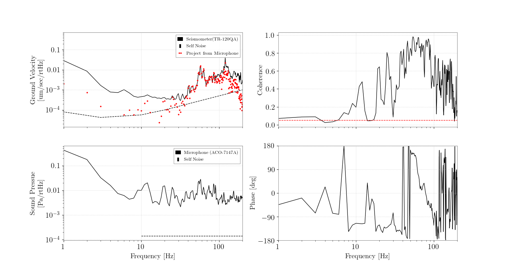

## データについて
* ファンがついている。
* 

## Sound Pressure Level (音圧レベル)
* p0=20\*1e-6 Paを基準にしている。
* dB = 20\*log(p/p0)
* ACO 7147A　のSelfNoiseは17dBなので、10**(17/20)*p0 = 
* Manual : [企業Hp](http://www.aco-japan.co.jp/english/product/id570.html)
* db(A)はおそらくA特性のことだと思う。[Wikipedia](https://ja.wikipedia.org/wiki/A%E7%89%B9%E6%80%A7)

## 音圧ノイズのカップリング

マイク

 

左上：

* 地震計のZ軸のAmplitudeSpectrumDensity（黒実線）
* 地震計のSelfNoise（黒点線）
* マイクのASDにコヒーレンスをかけたもの（赤点）

左下：

* 拡散型マイクのASD（黒実線）
* 拡散型マイクのSelfNoise（黒点線）

右上：

* 地震計とマイクのコヒーレンス（黒実線）
* xxx%の有意水準（赤点線）

右下：

* 位相（黒実線）

## 