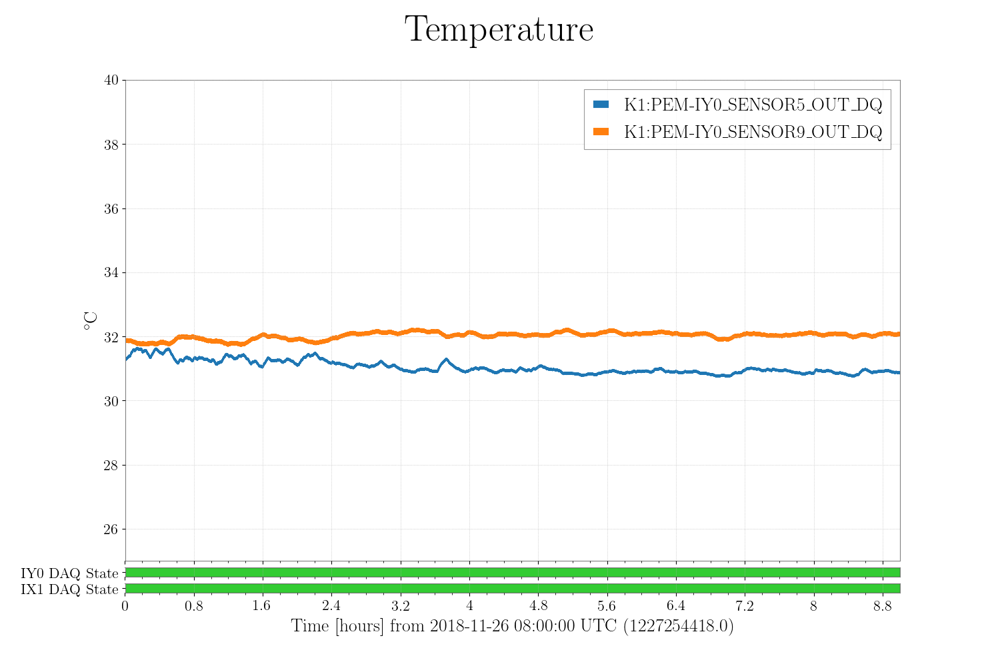
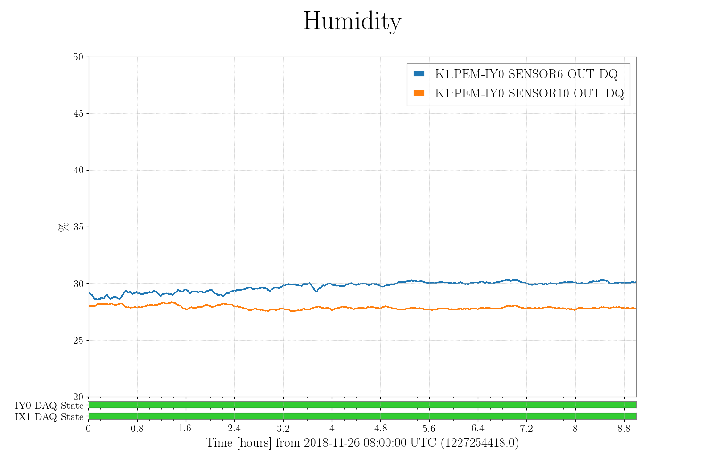
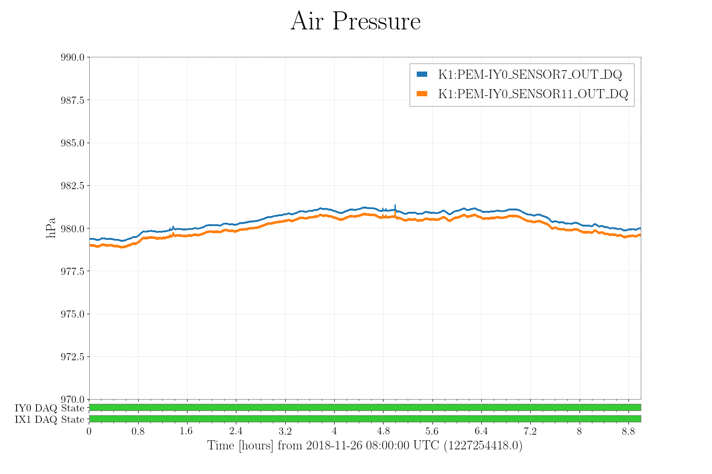
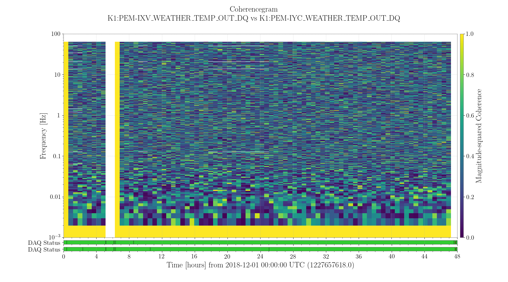
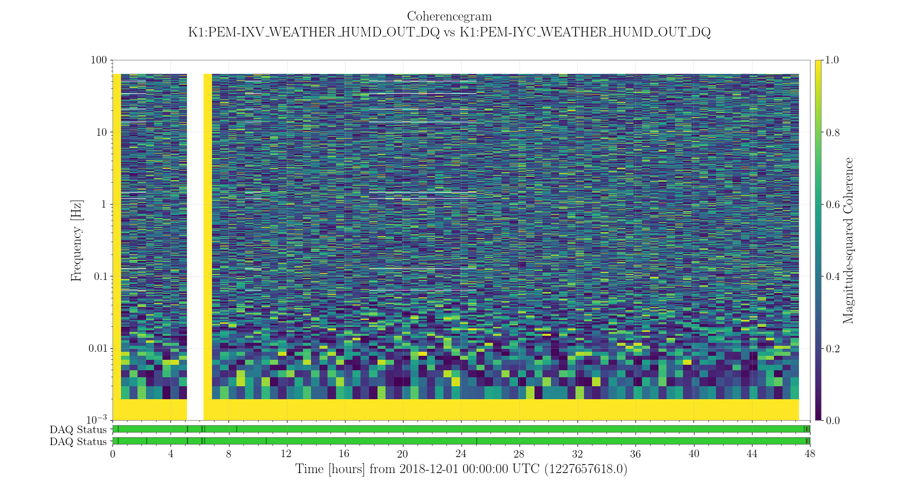
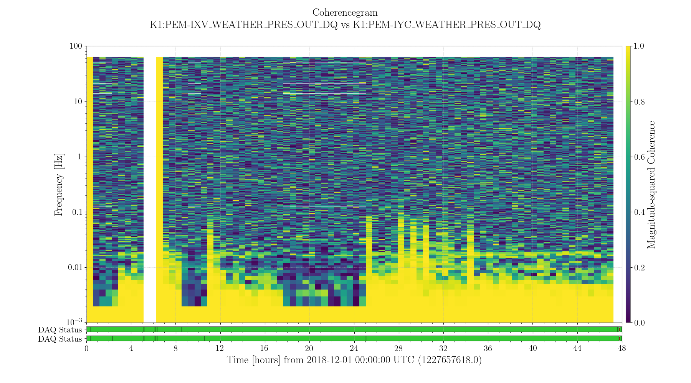
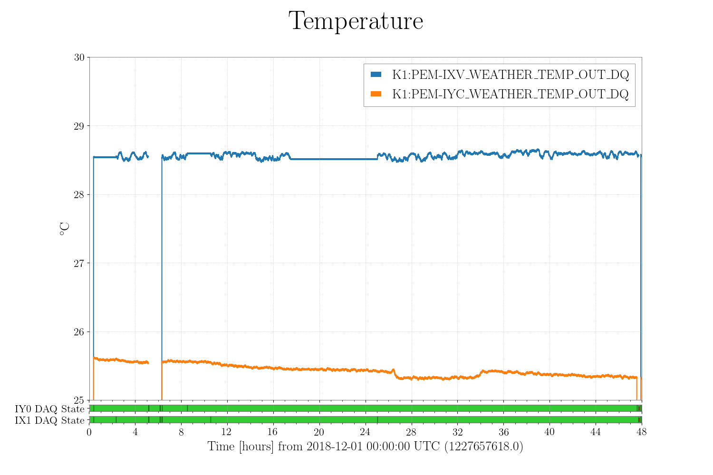
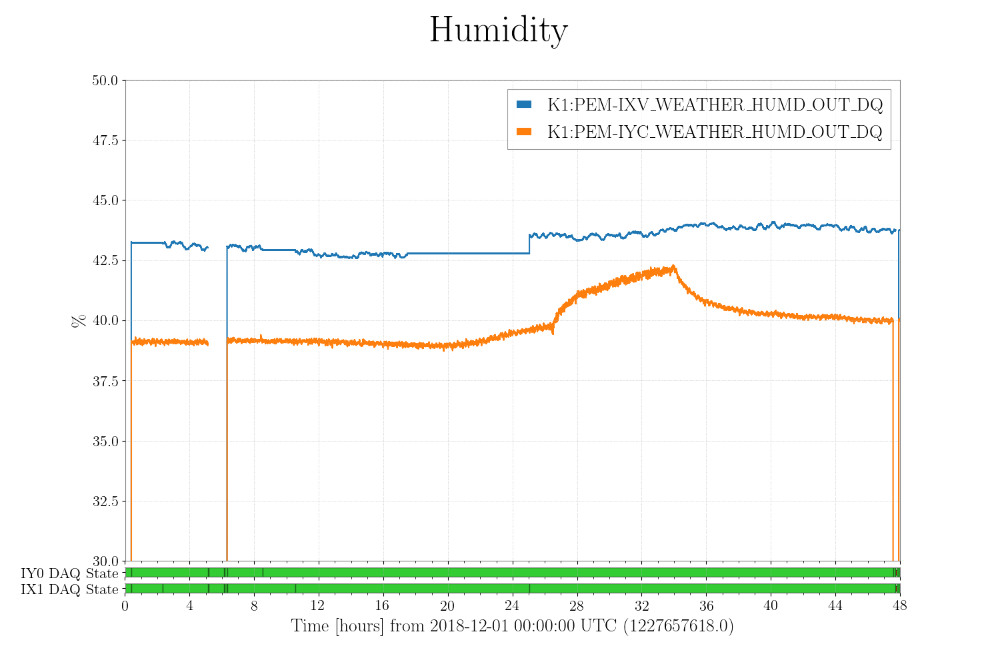

# Charactorization of the air environtment monitor
## Abstruct
* IXVとIYCにインストールした気象計(No.5とNo.6)は安定して環境を計測できている。
* まず気象計のDC値のばらつきを調べるためにNo.5とNo.6をIY0ラックのなかに設置して9時間測定した。その結果、温度計では〇〇℃、湿度計ではXX%、気圧計ではYYhPaほどばらついた。センサーのデータシートと矛盾しない。
* 次にNo.5をIXVにNo.6をIYCに設置して、センターの1階と2階で環境信号の相関を調べた。その結果、温度と湿度は1階と二階で相関をもたず、一方で気圧は0.1Hz以下で相関をもっていることがわかった。
* 今後は残りのエリア(PSL、EXV、EYV、の順)にインストールする。

## Background and Purpose

 

## Timeseries of work logs
* Nov 26 2018 11:10頃 : No5とNo6をIY0ラックに入れて測定開始。一晩測定。
* Nov 27 2018 09:35頃 : IY0ラックから取り出した。
* Nov 27 2018 11:15頃 : No5をIXVの地震計のそばに、No6をIYCの移動用階段にマウントした。
* Nov ?? 2018 ??:??頃 : IY0_SENSORからIYC_WEATHERのチャンネル名にかえた。これを最後にNDSからデータは見れない。
* Nov 27 2018 11:15頃
* Nov 28 2018 21:30頃 : PEMの地震計と気象計のモデルを一新したのでDAQを再起動した。
* Nov 28 2018 22:00頃 : 安定してデータがとれはじめた。このときから15時間はIY0とIX1のDAQは正常。
* Nov 29 2018 14:00頃 : DAQ再起動？欠損しているので多分そう。
* Nov 30 2018 01:00頃 : DAQに問題はなさそうだがIX0のデータがおかしい。ずっと同じ値を取っている。***DAQステータス以外に見るべきチャンネルがありそう。***
* Nov 30 2018 09:00頃 : 問題のIX0が復活した。

-> （Nov26 17:00 - Nov27 02:00） 9時間安定したデータ

-> （Nov28 18:00 - Nov29 13:00） 15時間安定したデータ

## Measurement
### MeasurementA : DC measurement
* 目的 : DC値のばらつきを調べる。
* 解析期間：
* 測定A：No5とNo6をIY0ラックの中に入れて同時測定

#### 使用したチャンネル
| チャンネル名 | 用途 | 単位 | fs [Hz] |
|:-----------|:----|:----:|:--------|
| K1:PEM-IXV\_SENSOR5\_TEMP\_OUT\_DQ | IXV 温度 | count | 2048 |
| K1:PEM-IXV\_SENSOR6\_HUMD\_OUT\_DQ | IXV 湿度 | count | 2048 |
| K1:PEM-IXV\_SENSOR7\_PRES\_OUT\_DQ | IXV 気圧 | count | 2048 |
| K1:PEM-IYC\_SENSOR9\_TEMP\_OUT\_DQ | IYC 温度 | count | 2048 |
| K1:PEM-IYC\_SENSOR10\_HUMD\_OUT\_DQ | IYC 湿度 | count | 2048 |
| K1:PEM-IYC\_SENSOR11\_PRES\_OUT\_DQ | IYC 気圧 | count | 2048 |
| K1:FEC-99\_STATE\_WORD\_FE | DAQ status about the IY0 rack | count | 16 |
| K1:FEC-121\_STATE\_WORD\_FE | DAQ status about the IX1 rack | count | 16 |

#### 結果
最大で、温度は1℃、湿度は2％、気圧は0.5hPaオフセットを持っている。
データシートによると、温度計は±0.06℃、湿度計は±1%、気圧計は±0.6hPaの精度を持つので、温度計だけあきらかにオフセットを持っている。

温度

湿度

気圧

### MeasurementB : Noise investigation
* 解析期間：(15時間分) Nov28 18:00 -  Nov29 13:00
* 測定B：No5はIXV、No6はIYCエリアにおいて、互いの相関を調べた。

#### 使用したチャンネル

| チャンネル名 | 用途 | 単位 | fs [Hz] |
|:-----------|:----|:----:|:--------|
| K1:PEM-IXV\_WEATHER\_TEMP\_OUT\_DQ | IXV 温度 | deg_c | 128 |
| K1:PEM-IXV\_WEATHER\_HUMD\_OUT\_DQ | IXV 湿度 | pc | 128 |
| K1:PEM-IXV\_WEATHER\_PRES\_OUT\_DQ | IXV 気圧 | hPa | 128 |
| K1:PEM-IYC\_WEATHER\_TEMP\_OUT\_DQ | IYC 温度 | deg_c | 128 |
| K1:PEM-IYC\_WEATHER\_HUMD\_OUT\_DQ | IYC 湿度 | pc | 128 |
| K1:PEM-IYC\_WEATHER\_PRES\_OUT\_DQ | IYC 気圧 | hPa | 128 |
| K1:FEC-99\_STATE\_WORD\_FE | DAQ status about the IY0 rack | count | 16 |
| K1:FEC-121\_STATE\_WORD\_FE | DAQ status about the IX1 rack | count | 16 |

#### 結果（コヒーレンスグラム）
IYCとIXVで、温度と湿度は相関を持たないが気圧は0.1Hz以下で相関を持っている。相関がある周波数帯域は時間変化してる。

温度

湿度

気圧

### 考察
#### 温度計のオフセット問題
* おそらくIY0ラックのADCの上においたせいで、その場所ごとの発熱のムラをみていた。というのも、IYCとIXVにおいたときの温度と湿度はすごく安定しているので（下図）。なので次は、余っているADCの兼ね合いもあるので、IYCにもう一台置いてみることにする。
* それかオペアンプのオフセット電圧からきているか。その場合、どうやって測ればいい？
 * ちなみに[OP27G](https://www.analog.com/media/en/technical-documentation/data-sheets/op27.pdf)のオフセット電圧は最大で100uVある。ゲインは78倍なので出力電圧に換算すると0.8mV程度。これは温度に換算すると0.02℃なので十分小さい。

温度

湿度

#### 温度と湿度は回路雑音で埋もれている
* MeasurementBでは温度計と湿度計は、それぞれIYCとIXVでコヒーレンスをもたなかった。

#### 気圧の場合、相関がある周波数帯域が時間変化している

### 結論
温度計、湿度計は低周波では回路雑音に埋もれている。

### 今後
* 温度のオフセット値問題に決着をつけるために、IYCにもう一台置いて測り直す。
* 回路の雑音をLTSpiceかなにかで計算して、最適なアンプのゲインを決める。もうこのままで良い気もするけど。
* 気圧はもっと低周波で相関がどうなるか調べたい。
